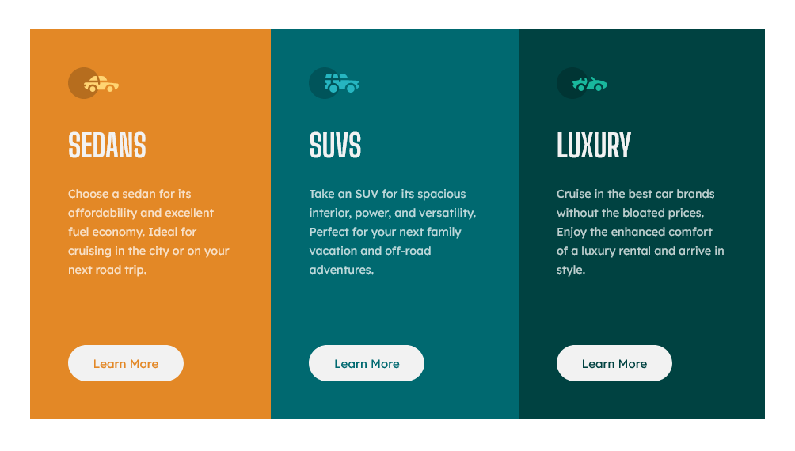

# Frontend Mentor - 3-column preview card component solution

This is a solution to the [3-column preview card component challenge on Frontend Mentor](https://www.frontendmentor.io/challenges/3column-preview-card-component-pH92eAR2-). Frontend Mentor challenges help you improve your coding skills by building realistic projects. 

## Table of contents

- [Overview](#overview)
  - [Screenshot](#screenshot)
  - [Links](#links)
  - [Built with](#built-with)
  - [Author](#author)

### Screenshot

### Links

- Solution URL: [https://github.com/MitaliShah/3-column-preview-card](https://github.com/MitaliShah/3-column-preview-card)
- Live Site URL: [https://mitalishah.github.io/3-column-preview-card/](https://mitalishah.github.io/3-column-preview-card/)

### Built with

- Semantic HTML5 markup
- Flexbox
- CSS
- Mobile-first workflow

## Author
- Frontend Mentor - [@MitaliShah](https://www.frontendmentor.io/profile/MitaliShah)
